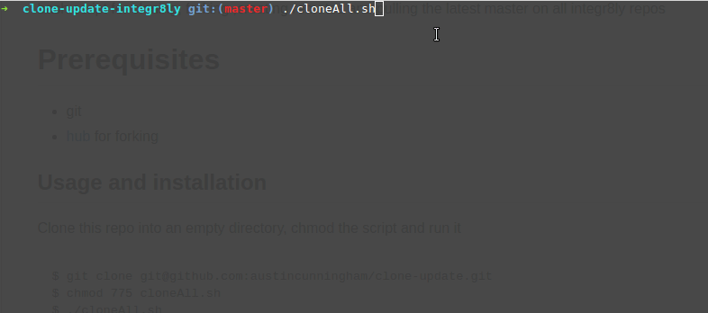

# clone-update

bash script for cloning, forking ,creating remotes and pulling the latest master on all integr8ly repos



# Prerequisites 

- git
- [hub](https://hub.github.com/) for forking

## Usage and installation

Clone this repo into an empty directory, chmod the script and run it 

```bash
$ git clone git@github.com:austincunningham/clone-update-integr8ly.git
$ chmod 775 cloneAll.sh
$ ./cloneAll.sh

```
Creates the repos in the following directory structure

```bash
.
..
integreatly-website-ui-bundle
middleware-load-testing
integr8ly.github.io
manifests
fuse-online-install
amq-online-images
3scale-operator
prometheus-operator
delorean-pipeline-library
tower_dummy_credentials
operator-registry
integreatly-operator
shepherd
grafana_plugins_init
ansible-tower-configuration
backup-container-image
user-documentation
ci-cd-pipeline-library
application-monitoring-operator
grafana-operator
sso_plugins_init
version-checker
walkthrough-template
tutorial-web-app-walkthroughs
keycloak-operator
location-soap2rest
location-soap
operator-sdk-openshift-utils
example-customisations
apicurio-operator
gitea-operator
3scale-operator-old
dayinthelife-integration
ci-cd
fuse-flights-aggregator
tutorial-web-app-operator
release
managed-service-controller
managed-service-broker
spboot-example
syndesis
integration-controller
walkthrough-operator
openshift-resource-parser
tutorial-web-app
launcher-booster-catalog
nodejs-messaging-work-queue
walkthroughs
installation
installation-notes
```
> *NOTE*: Some repos are written in go and need to be moved to the gopath , Will add as a todo for this script